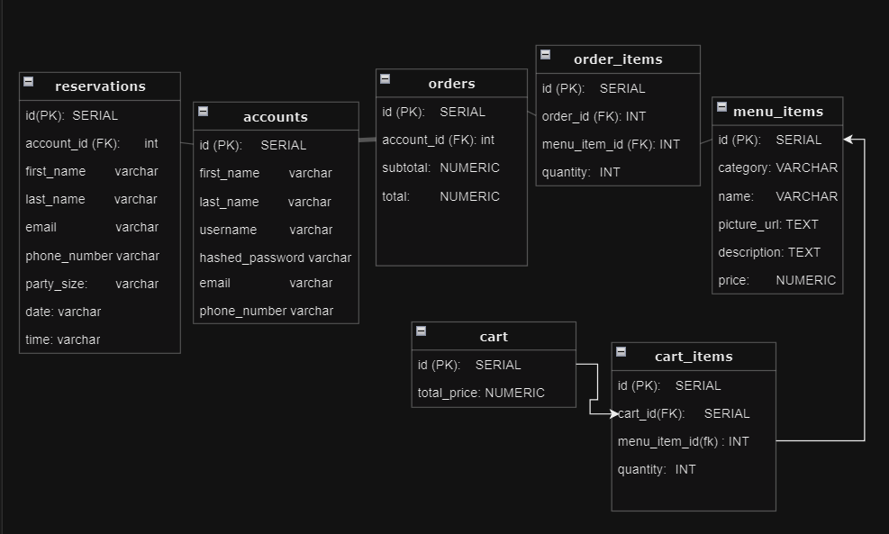

# Back of the House Restaurant App

## Local Hosting
- **Localhost Backend**: http://localhost:8000/docs
- **Localhost Frontend**: http://localhost:3000

## Deployed / Production
- ** NO LONGER DEPLOYED **
- **Deployed Project** - https://backofthehouse.gitlab.io/gastronomical-gems
- **Deployed Backend/OpenAPI** - https://mar-2-pt-fastrapi.mod3projects.com/docs#/

**ERD Diagram:** 

## Team Contributions:
### [Kenny](https://gitlab.com/kenny.phung12)
- Created Tables: Reservations, Accounts
- All Account endpoints
- All Reservations endpoints
- Front and backend Auth
- Front & back End: Login & Logout
- Unit Test: test_accounts.py

### [Ed](https://gitlab.com/eleet94)
- Created Table: menu_items
- All Menu_item, Cart, and Cart_item endpoints
- Frontend: Cart Page
- Unit Test: test_menu_items.py

### [Benjamin](https://gitlab.com/benjaminostler)
- Created Table: Order_items
- Order_items Endpoints: Create, Get One
- Orders Endpoints: Get All
- Front End: Main page, Orders Page, Create Order Page, Create Menu Item Page
- Unit Test: test_order_history.py
- Created Zoom Background

### [Alec]()
- Created Table: Orders
- Orders Endpoints: Get One, Create, Update, Delete
- Unit Test: test_order_items.py

### [Raymond Quach](https://gitlab.com/Rayblah)
- Created Table: Order_items
- Order_items Endpoints: Update, Delete
- Front End: Reservations Page, Create Reservation Page
- Unit Test: test_reservations.py
