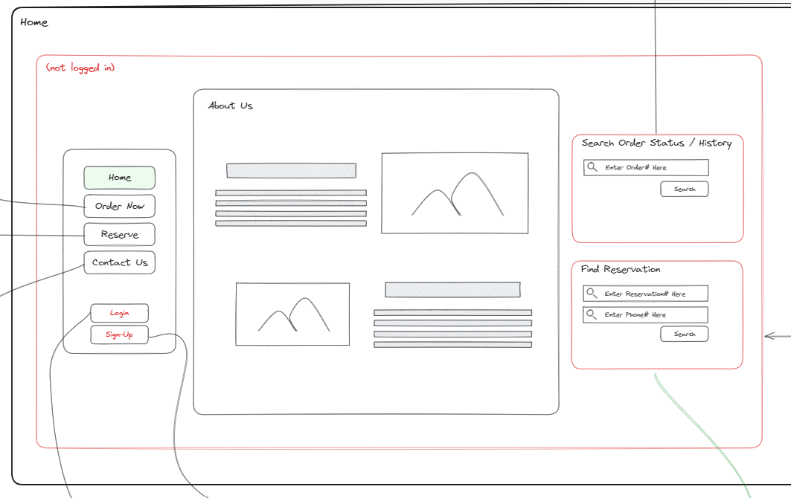
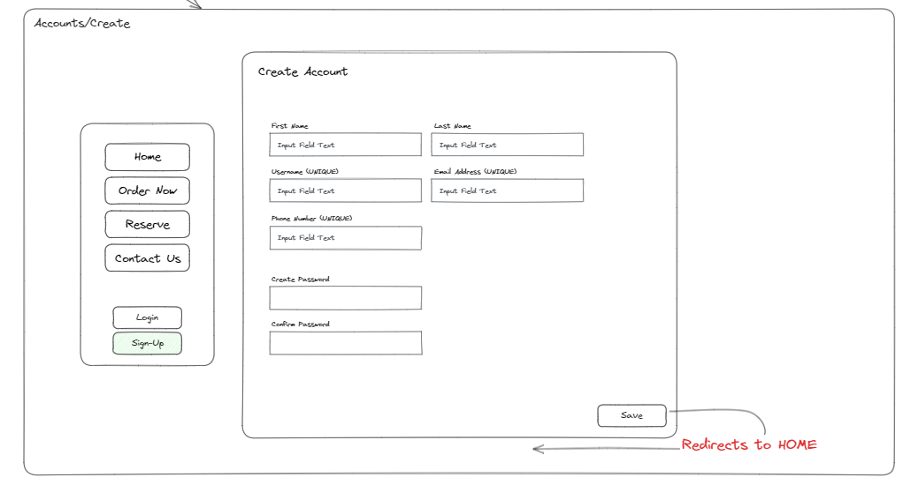
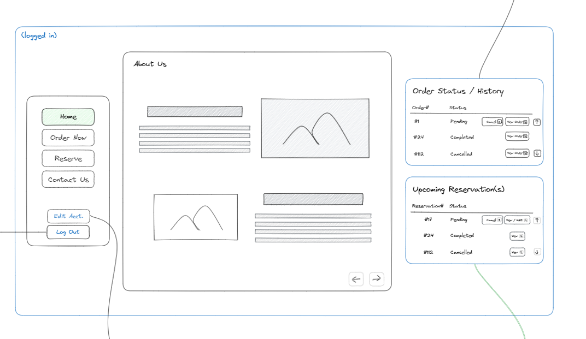
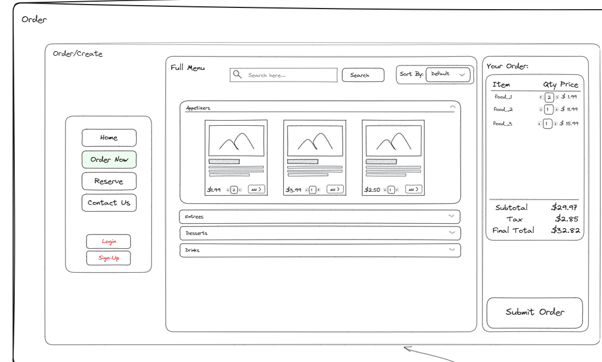
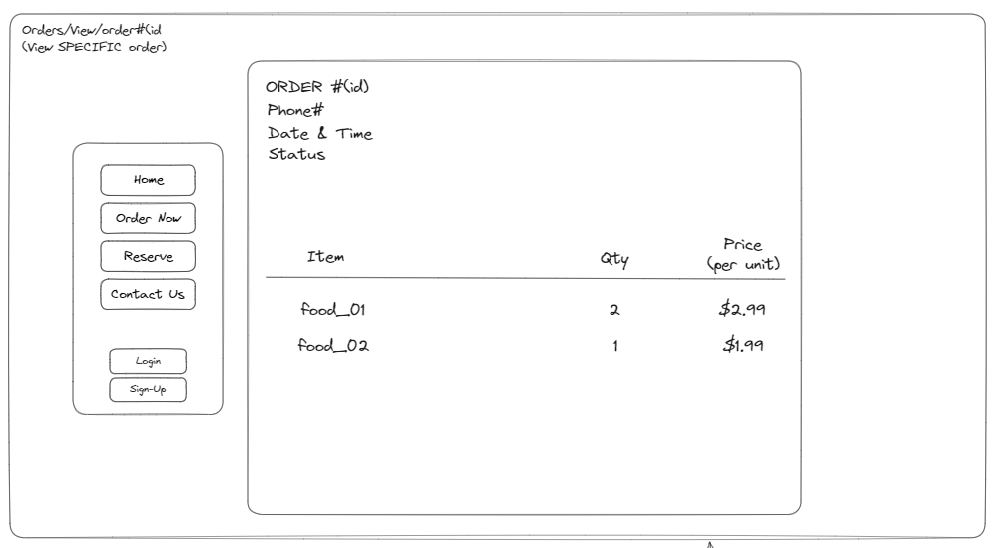
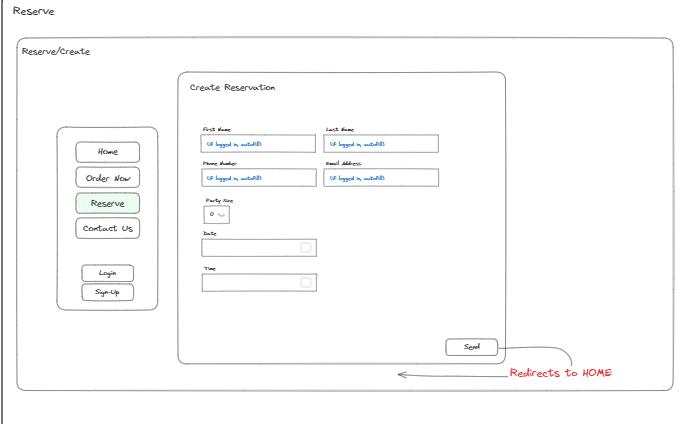
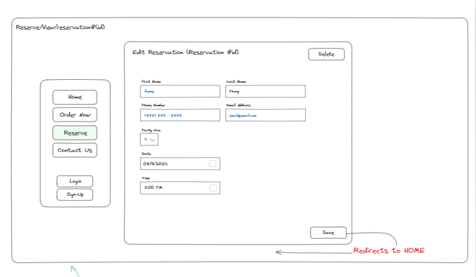

# User Story Using WireFrames

## Home Page 

Our landing page when you're not logged in. Users have access to a nav bar with list items but won't have create or edit functionality.

## Signup Page

Allows users to sign in with a username. Signing up allows users to create menu items, reservations and orders as well as have access to their cart. Users can also edit these parameters after being authenticated.

## Post Login Page

Users who sign up and log in will be able to create orders, reservations and menu items.

## Order Form

Create an order by adding menu items to cart, then checking out to create an order instance. Orders will be listed on the orders history page. 

## View Order

View order details under the order history page. Orders can be stored by users by their account and cart id. 

## Create Reservation

Make a reservation for an event or restaurant visit by filling out the designated parameters and being logged in. 

## Edit Reservation

Users could edit their resrvation info by going to the appropriate link and altering their desired data. 

